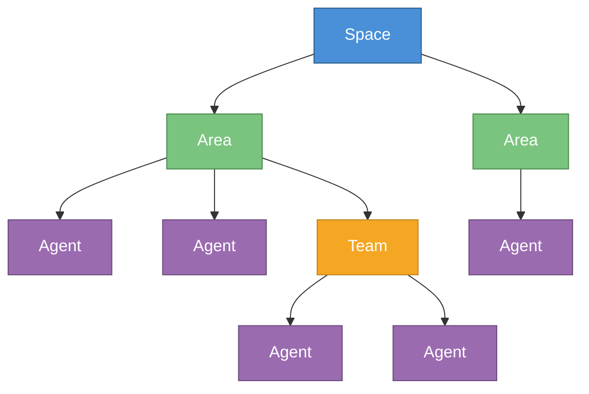
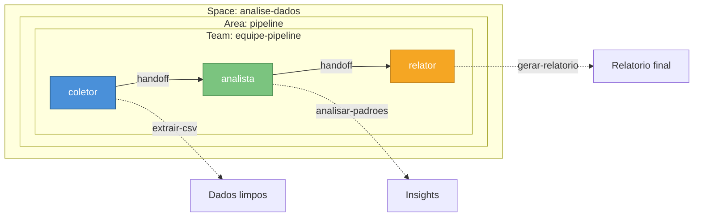
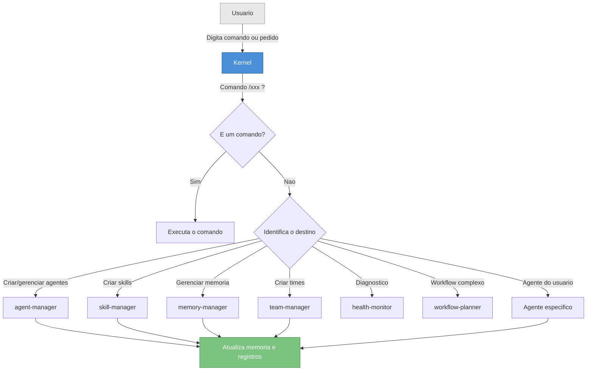
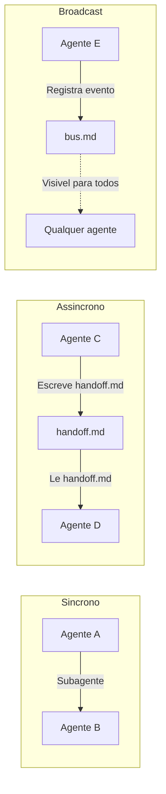

# Como Comecar com o AgentOS

## O que e o AgentOS?

Imagine um sistema operacional como o Windows ou o Linux. Ele gerencia programas, memoria e a comunicacao entre eles. O **AgentOS** faz a mesma coisa, mas para **agentes de IA**.

Com o AgentOS, voce cria agentes especializados — cada um com sua propria personalidade, habilidades e memoria — e os organiza em espacos de trabalho isolados. Eles podem trabalhar sozinhos ou em equipe, passando tarefas entre si de forma coordenada.

**Para quem e o AgentOS?**

- Voce quer automatizar processos usando agentes de IA
- Voce precisa de varios agentes trabalhando juntos de forma organizada
- Voce quer que seus agentes tenham memoria persistente entre sessoes
- Voce quer padronizar como agentes sao criados e gerenciados

O AgentOS roda sobre o **Claude Code** ou o **Gemini CLI** — voce interage com ele usando comandos no terminal. Os dois runtimes sao totalmente suportados e compartilham a mesma base de agentes, memoria e protocolos.

---

## Conceitos Essenciais

Antes de criar qualquer coisa, e importante entender os blocos fundamentais do AgentOS.

### Hierarquia de recursos



### Space

Um **space** e o nivel mais alto de organizacao. Pense nele como um **projeto** ou **dominio de trabalho** completamente isolado. Agentes de um space nao enxergam agentes de outro space.

**Quando criar um space:** Sempre que voce comecar um novo projeto ou dominio. Exemplos: `automacao-vendas`, `analise-dados`, `suporte-cliente`.

### Area

Uma **area** e uma subdivisao dentro de um space. Ela agrupa agentes e times que trabalham no mesmo tema.

**Quando criar uma area:** Quando seu space tem dominios distintos. Exemplos: `backend`, `frontend`, `dados`, `operacoes`.

### Agent

Um **agent** e a unidade fundamental do AgentOS. Cada agente tem:

- **Persona** — Quem ele e (ex: "Analista de dados senior")
- **Capacidades** — O que ele sabe fazer (ex: "Analisar CSVs, gerar relatorios")
- **Skills** — Processos documentados que ele executa
- **Memoria** — Historico de acoes e contexto acumulado

**Regra de ouro:** Um agente, uma responsabilidade. Agentes focados sao mais eficazes do que agentes genericos.

### Team

Um **team** e um grupo de agentes que colaboram dentro de uma area. O time tem memoria compartilhada e um agente lider que coordena os demais.

**Quando criar um time:** Quando dois ou mais agentes precisam trabalhar juntos em tarefas relacionadas. Se um agente trabalha sozinho, nao precisa de time.

### Skill

Uma **skill** e um processo documentado que um agente sabe executar. Ela define passo a passo como o agente deve realizar uma tarefa especifica.

**Por que usar skills:** Sem skills, o agente improvisa. Com skills, o comportamento e previsivel e repetivel. Pense em skills como "manuais de procedimento" do agente.

### Memory

Cada agente, time, area e space tem sua propria **memoria**. Agentes leem a memoria antes de agir, o que lhes da contexto sobre o que ja foi feito.

Os principais arquivos de memoria sao:

| Arquivo | O que contem |
|---|---|
| `world.md` | Foto do estado atual (o que existe, o que mudou) |
| `history.md` | Historico de acoes do agente (o que ele ja fez) |
| `handoff.md` | Tarefas pendentes passadas entre agentes |

---

## Pre-requisitos

Antes de comecar, voce precisa de:

1. **Claude Code** ou **Gemini CLI** instalado e configurado no seu terminal
2. **Repositorio do AgentOS** clonado no seu computador
3. **Bootstrap executado** — se e a primeira vez, rode:

```
/setup
```

O comando `/setup` cria toda a estrutura interna do sistema (agentes de sistema, protocolos, memoria). Voce so precisa rodar isso uma vez.

Para confirmar que tudo esta funcionando:

```
/status
```

Voce vera um resumo com os 19 agentes de sistema ativos (8 core + 11 skills Anthropic) e 0 spaces criados (ja que voce ainda nao criou nenhum).

---

## Passo a Passo: Seu Primeiro Agente

Vamos criar um agente do zero. Ao final deste tutorial, voce tera um space com uma area, um agente e uma skill funcionando.

### Passo 1 — Verificar o sistema

```
/status
```

Confirme que o sistema esta ativo e que os agentes de sistema estao funcionando. Se o comando nao funcionar, rode `/setup` primeiro.

### Passo 2 — Criar um space

Vamos criar um space chamado `meu-projeto`:

```
/new-space meu-projeto
```

O `agent-manager` ira criar a seguinte estrutura:

```
spaces/meu-projeto/
├── SPACE.md              ← Manifesto do space
├── memory/
│   ├── world.md          ← Estado do space
│   └── handoff.md        ← Tarefas pendentes
├── guidelines/
│   └── GUIDELINES.md     ← Documentacao do space
└── areas/                ← Vazio (ainda sem areas)
```

O sistema vai perguntar o **proposito** do space. Descreva brevemente para que ele serve — essa informacao ajuda agentes a entenderem o contexto.

### Passo 3 — Criar uma area

Dentro do space, crie uma area:

```
/new-area meu-projeto backend
```

Isso cria a estrutura dentro de `spaces/meu-projeto/areas/backend/`, com diretorios para agentes, times e memoria.

### Passo 4 — Criar um agente

Agora, o momento principal — criar seu agente:

```
/new-agent meu-projeto backend assistente
```

O sistema vai te perguntar:

- **Persona:** Quem e esse agente? (ex: "Assistente de desenvolvimento backend")
- **Capacidades:** O que ele sabe fazer? (ex: "Revisar codigo, sugerir melhorias, documentar APIs")
- **Regras:** Alguma restricao? (ex: "Sempre seguir os padroes REST do projeto")

Apos responder, o `agent-manager` cria:

```
spaces/meu-projeto/areas/backend/agents/assistente/
├── AGENT.md              ← Definicao do agente
├── memory/
│   └── history.md        ← Historico de acoes
└── skills/               ← Vazio (ainda sem skills)
```

E tambem registra o agente nos runtimes:
- **Claude Code:** `.claude/agents/meu-projeto--backend--assistente.md`
- **Gemini CLI:** `.gemini/agents/meu-projeto--backend--assistente.md`

Isso torna o agente invocavel como subagente em qualquer um dos dois runtimes.

### Passo 5 — Adicionar uma skill

De ao seu agente uma habilidade especifica:

```
/new-skill meu-projeto/backend/assistente revisar-codigo
```

O `skill-manager` vai guiar voce pelo processo:

1. **Proposito:** O que essa skill faz? (ex: "Revisa pull requests buscando bugs e melhorias")
2. **Processo:** Quais sao os passos? (ex: "1. Ler o diff 2. Identificar problemas 3. Sugerir correcoes")
3. **Inputs:** O que o agente precisa receber? (ex: "URL do PR ou diff do codigo")
4. **Outputs:** O que ele entrega? (ex: "Lista de problemas encontrados com sugestoes")

A skill e salva em `spaces/meu-projeto/areas/backend/agents/assistente/skills/revisar-codigo/SKILL.md`.

### Passo 6 — Interagir com o agente

Seu agente esta pronto! Para usa-lo, basta pedir ao runtime para invoca-lo. Tanto o Claude Code quanto o Gemini CLI identificam e roteiam automaticamente para o agente correto.

**No Claude Code:**
> "Peca ao agente assistente do backend do meu-projeto para revisar este codigo"

**No Gemini CLI:**
> "Use @meu-projeto--backend--assistente para revisar este codigo"

Ou, de forma mais natural em qualquer runtime:
> "Use o assistente para revisar o ultimo PR"

O agente ira:
1. Ler seu `AGENT.md` (quem ele e)
2. Ler seu `history.md` (o que ja fez)
3. Ler o `world.md` da area e do sistema (contexto global)
4. Executar a tarefa usando suas skills
5. Atualizar sua memoria com o que fez

---

## Cenario Pratico: Automacao de Analise de Dados

Vamos criar um cenario completo e realista para ilustrar o poder do AgentOS.

### Contexto

Voce trabalha com dados e quer automatizar o processo de:
1. **Coletar** dados de diferentes fontes
2. **Analisar** os dados e encontrar padroes
3. **Gerar relatorios** com os resultados

### Criando a estrutura

```
/new-space analise-dados
/new-area analise-dados pipeline
```

### Criando os agentes

```
/new-agent analise-dados pipeline coletor
```
- **Persona:** Especialista em coleta e integracao de dados
- **Capacidades:** Ler CSVs, conectar APIs, validar dados, limpar duplicatas

```
/new-agent analise-dados pipeline analista
```
- **Persona:** Cientista de dados senior
- **Capacidades:** Analise estatistica, identificar padroes, gerar insights

```
/new-agent analise-dados pipeline relator
```
- **Persona:** Especialista em comunicacao de dados
- **Capacidades:** Gerar relatorios claros, criar visualizacoes, resumir para executivos

### Adicionando skills

```
/new-skill analise-dados/pipeline/coletor extrair-csv
/new-skill analise-dados/pipeline/analista analisar-padroes
/new-skill analise-dados/pipeline/relator gerar-relatorio
```

### Criando o time

```
/new-team analise-dados pipeline equipe-pipeline
```

O `team-manager` vai pedir:
- **Proposito:** Equipe responsavel pelo pipeline completo de dados
- **Membros:** coletor, analista, relator
- **Lider:** analista (coordena o fluxo)

### Resultado final



### Usando o pipeline

Com a estrutura criada, voce pode:

1. Pedir ao **coletor** para extrair os dados
2. Criar um **handoff** para o analista processar os dados:
   ```
   /handoff coletor analista "Analisar os dados coletados do Q1 2026"
   ```
3. O analista processa e passa para o **relator** gerar o documento final

Cada agente atualiza sua memoria ao final, entao na proxima vez que voce pedir algo, eles ja sabem o que foi feito antes.

---

## Como o AgentOS Funciona por Dentro

### Fluxo de uma solicitacao



### Comunicacao entre agentes



Existem tres formas de comunicacao:

1. **Invocacao direta** — Um agente chama outro e espera a resposta (sincrono)
2. **Handoff** — Um agente deixa uma tarefa para outro resolver depois (assincrono)
3. **Message bus** — Um agente registra um evento que todos podem ver (broadcast)

---

## Dicas Importantes

| Dica | Por que |
|---|---|
| Use **kebab-case** nos nomes | O sistema exige letras minusculas e hifens. Ex: `analise-dados`, nao `Analise_Dados` |
| **Um agente, uma responsabilidade** | Agentes focados sao mais eficazes. Melhor ter 3 agentes simples do que 1 agente que faz tudo |
| **Skills documentam processos** | Sem skill, o agente improvisa. Com skill, ele segue um processo previsivel |
| **Memoria e contexto** | Agentes leem a memoria antes de agir. Mantenha `world.md` e `history.md` atualizados |
| **Areas organizam** | Use areas para separar dominios. Ex: `backend` e `frontend` em areas diferentes |
| **Teams coordenam** | Use times quando agentes precisam colaborar em fluxos sequenciais |

---

## Troubleshooting & FAQ

### O comando `/setup` falhou ou nao fez nada

**Causa provavel:** O sistema ja foi instalado anteriormente.
**Solucao:** Rode `/status` para verificar. Se o sistema ja esta ativo, nao precisa rodar `/setup` novamente.

### O comando `/new-space` nao funcionou

**Causa provavel:** O sistema nao foi inicializado.
**Solucao:** Rode `/setup` primeiro, depois tente criar o space novamente.

### Meu agente nao aparece no runtime (Claude Code ou Gemini CLI)

**Causa provavel:** O arquivo de integracao nao foi criado no diretorio do runtime.
**Solucao:** Verifique se existem os arquivos:
- `.claude/agents/{space}--{area}--{agente}.md` (Claude Code)
- `.gemini/agents/{space}--{area}--{agente}.md` (Gemini CLI)

Se nao existirem, recrie o agente com `/new-agent` ou rode `/setup` para sincronizar os runtimes.

### Como vejo o que meu agente sabe/fez?

Leia a memoria dele diretamente:
- **Quem ele e:** `spaces/{space}/areas/{area}/agents/{agente}/AGENT.md`
- **O que ele fez:** `spaces/{space}/areas/{area}/agents/{agente}/memory/history.md`
- **Estado da area:** `spaces/{space}/areas/{area}/memory/world.md`

### Como passo trabalho de um agente para outro?

Use o comando de handoff:

```
/handoff agente-origem agente-destino "Descricao da tarefa"
```

O agente de destino vera a tarefa pendente na proxima vez que for invocado.

### Agentes de spaces diferentes podem se comunicar?

**Nao.** Spaces sao completamente isolados. Isso e intencional — garante que projetos diferentes nao interfiram entre si. Se voce precisa que agentes colaborem, eles devem estar no mesmo space.

### Quando usar um time vs agentes soltos na area?

| Cenario | Recomendacao |
|---|---|
| Agente trabalha sozinho em tarefas independentes | Agente direto na area |
| 2+ agentes precisam trocar informacoes e colaborar | Crie um time |
| Fluxo sequencial (A faz, passa para B, B passa para C) | Time com handoffs |
| Agentes compartilham contexto/estado | Time com memoria compartilhada |

### Como atualizo um agente que ja existe?

Voce pode editar diretamente o `AGENT.md` do agente, ou pedir ao sistema para evoluir o agente:

> "Evolua o agente assistente do backend do meu-projeto para incluir capacidade de testes"

O `agent-manager` atualizara a definicao do agente mantendo a memoria e skills existentes.

### O `/health` mostrou problemas, o que faco?

O comando `/health` roda um diagnostico completo. Se ele encontrar problemas (como arquivos faltando ou registros desatualizados), ele cria automaticamente **handoffs** para os agentes responsaveis corrigirem. Na maioria dos casos, basta rodar `/health` e os problemas serao resolvidos na proxima interacao.

---

## Comandos Rapidos de Referencia

| O que voce quer fazer | Comando |
|---|---|
| Ver o estado do sistema | `/status` |
| Criar um space | `/new-space <nome>` |
| Criar uma area | `/new-area <space> <nome>` |
| Criar um agente | `/new-agent <space> <area> <nome>` |
| Criar uma skill | `/new-skill <space/area/agente> <nome>` |
| Criar um time | `/new-team <space> <area> <nome>` |
| Passar tarefa entre agentes | `/handoff <de> <para> <tarefa>` |
| Operar o Git do Boris Painel | `/painel <status\|commit\|push\|pull> [mensagem]` |
| Diagnosticar problemas | `/health` |
| Planejar sem executar | `/plan <descricao>` |
| Executar um workflow | `/run <workflow>` |
| Ver workflows disponiveis | `/workflows` |

---

## Proximos Passos

Agora que voce sabe o basico, explore a documentacao completa:

- [Criando spaces, areas, agentes e times](creating-projects.md) — guia detalhado de criacao com o que acontece por tras dos panos
- [Sistema de memoria](memory-system.md) — como a memoria funciona em cada escopo
- [Comandos](commands.md) — referencia completa com exemplos
- [Agentes do sistema](system-agents.md) — o que cada agente de sistema pode fazer por voce
- [Protocolos](protocols.md) — como agentes se comunicam e gerenciam memoria
- [Arquitetura](architecture.md) — entenda a estrutura tecnica do sistema
- [Guia de desenvolvimento](development-guide.md) — para quem quer estender o AgentOS
